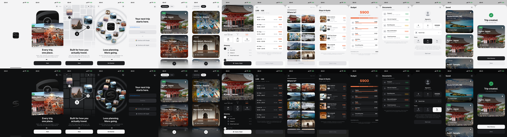

# Voyage

A native iOS trip planner, built in SwiftUI from a twelve-screen design and
carried on into the screens that design implies — **fifteen screens, each in
light, dark and system**, with **no third-party dependencies at all**.



> **Every trip, one place.** Flights, stays, itineraries and budgets, instead
> of a dozen browser tabs and a camera roll full of screenshots.

## Running it

```sh
Tools/build.sh                 # build for the simulator
Tools/screenshots.sh           # capture every screen in both themes
Tools/render-icon.sh           # regenerate the app icon from the mark
```

Xcode 16+, iOS 17+, iPhone portrait. No packages to resolve, no API keys, no
network calls — it runs offline on a clean machine.

## What is interesting in here

**Colour is declared as light/dark pairs on one line each.**

```swift
static let control = Pair(light: 0x1D1E21, dark: 0xF6F6F7)
```

The primary control is always the *inverse* of the page — near-black on the
light theme, near-white on the dark. Keeping both values adjacent is what stops
one theme being updated without the other.

**The icon and the in-app mark come from one file.** `Tools/render-icon.py`
crops the supplied logo out of its white canvas, fills the rounded corners back
in with the tile's own colour, and writes a 1024px icon and a 640px in-app
asset. Both are full-bleed squares — iOS masks the icon itself, and an icon
that rounds its own corners shows a hairline of background inside that mask.

**Every onboarding page animates when it is reached.** Cards deal in from
further off the left edge than a card is wide, so none is caught half-entering.
The route on page two draws itself, and each pin lands as the line arrives —
with the delays **computed from arc length** rather than hand-tuned, so they
stay in step if a stop moves. Page three settles its tiles outward, one by one.

**The illustration cards were rendering at 1.7× their frame.** `scaledToFill`
reports a size *larger* than the one it was offered, so a `ZStack` containing
it adopts that larger size and an outer `.frame()` then centres an oversized
card instead of shrinking it. The photograph is a background now, which cannot
affect layout at all.

**Photography ships at the size it is displayed.** Twelve CC0 destinations, as
1020×850 cards and 240×240 tiles — 1.7 MB in total, against roughly 90 MB of
originals. Nothing is resampled at runtime. Provenance for every image is in
[`CREDITS.json`](CREDITS.json).

**Screens are captured through debug launch arguments**, not by tapping:

```sh
-voyageStep onboarding -voyagePage 2
-voyageRoute flights
```

Twenty-two launches instead of a hundred-odd taps, and a tap landing a pixel
off cannot silently photograph the wrong screen.

**Flights, stays and itineraries are generated from a seed derived from the
trip**, so the same trip always offers the same options. A list that reshuffles
on every open makes "the one I saw a minute ago" impossible to find again.

**Money formats in one place.** `Text("$\(n)")` takes the `LocalizedStringKey`
overload and groups the digits while `Text(someString)` does not — so the same
number read "$1,800" on one screen and "$1800" on another, from what looks like
identical code.

## Layout

```
Art/          the supplied logo, the source the icon is derived from
Voyage/
  App/        @main, the step machine, the one observable model
  Design/     colour, type, controls, haptics
  Models/     Destination (the image seam), Trip, Flight, Itinerary
  Components/ AppMark, TripCard
  Screens/    one file per screen
Tools/        build, screenshots, icon rendering, vault link check
```

## What is not real yet

Every control goes somewhere; none of them reaches a server, because there is
no server. The auth screen validates an email's shape and continues, Google and
Apple are not wired, flights and stays are generated rather than searched, the
itinerary cannot be edited, and nothing but the onboarding flag and the theme
survives a relaunch. Selecting a flight saves
it to the trip rather than buying it, and the screen says so — a checkout that
appears to charge someone is worse than an honest dead end.

The full list is kept honest in `Voyage open items` — see below.

## Documentation

Voyage's notes live in an Obsidian vault at `~/Desktop/Obsidian/Claude Apps`,
in one graph alongside two other projects, so the lessons are shared rather
than learned three times:

- **Voyage** — the hub
- **Voyage architecture** · **Voyage design system** · **Voyage mark** ·
  **Voyage motion** · **Voyage photography** · **Voyage screens** ·
  **Voyage open items** · **Voyage what broke**

Voyage is deliberately **its own island** in that graph: nothing in its folder
links out and nothing links in, so its cluster reads as a separate project
rather than being pulled into another app's web through a shared hub.

Two checks keep that true — `Tools/check-vault-links.py` asserts every wikilink
in the vault resolves, and `Tools/check-vault-islands.py` asserts Voyage is
still unattached. One stray pair of brackets silently joins two clusters, and
only a graph view would otherwise show it.

## Licence

Code: see the repository owner. Photography: CC0 — see
[`CREDITS.json`](CREDITS.json).
